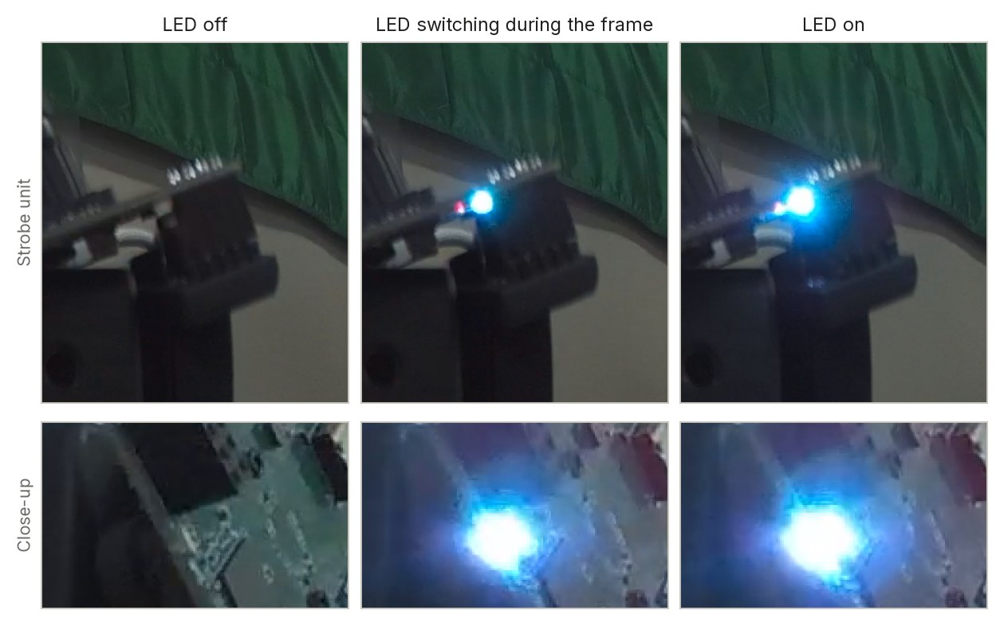
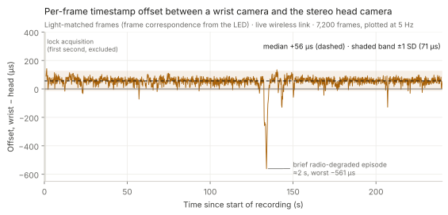
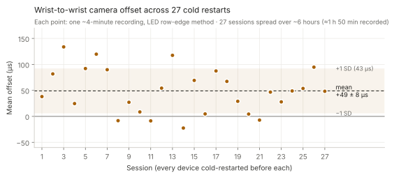
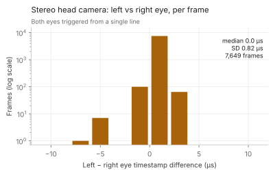
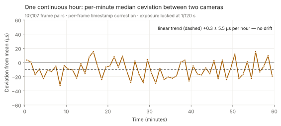

# Wireless synchronization of Trinet cameras — validation report

Panoculon Labs · Measurements 26–28 August 2026 · Report version 1.0, October 2026

## Summary

Trinet cameras in a [Wrist Kit](../products/wrist-kit.md) have no cables between them; each keeps
time with its own oscillator, and a short-range radio link brings all of them onto one shared clock.
This report measures how closely the resulting timestamps agree, using an **optical reference that
is independent of every clock under test**.

| Result | Value |
|---|---|
| Camera-to-camera offset, wrist vs stereo head (median, ~7,000 frames) | **+56 µs** |
| Mean offset over 27 sessions, each after a full cold restart | **+49 ± 8 µs** (mean ± standard error) |
| Session-to-session variation (standard deviation) | **43 µs** |
| Drift over one continuous hour | **None measurable** (+0.3 ± 5.5 µs per hour) |
| Stereo head camera, left vs right eye | **0.0 µs** median, 0.82 µs standard deviation |

All measured offsets are a small fraction of the 33.3 ms frame interval at 30 fps. We specify
camera-to-camera agreement conservatively as **under 1 ms**.

## 1. Test setup

| | |
|---|---|
| Cameras | A **Trinet Stereo** (rolling-shutter) head camera and Trinet wrist cameras, paired as a kit; a two-camera kit for the one-hour test |
| Link | The cameras' built-in radio link, operating live during recording |
| Recording | 1920 × 1080 at 30 fps to each camera's own memory card |
| Firmware | August 2026 builds |
| Environment | Indoor bench; exposure locked at 1/120 s for the one-hour test |

## 2. Method

**Optical ground truth.** An LED switching at randomized times was placed in view of every camera.
Because a rolling-shutter sensor exposes its rows one after another (about 29 µs per row), a frame
captured while the LED switches shows a brightness edge part-way down the image; the edge's row
position locates the switching instant within the frame to a fraction of a row. Comparing that
instant with each camera's own frame timestamps gives the timestamp error of every camera against the
same physical event — without reference to any clock being tested, and without per-unit calibration
inputs.

<strong>Figure 1.</strong> The LED reference as recorded by Trinet cameras during the experiments — top: the strobe unit; bottom: close-ups of the LED. In the centre frames the LED switched while the frame was being read out, so only part of the light is captured; where that transition falls in the sensor rows locates the switching instant to a fraction of a row. Original camera frames, cropped but not retouched.

**Frame pairing.** For the one-hour test, frames from the two cameras were paired by their timestamps
(precision about 8 µs) to measure frame-to-frame variation and long-term drift. Pairing measures
variation and drift; the optical method measures the absolute offset.

**Exclusions.** The first second of each recording, while a camera locks onto the shared clock, is
excluded from the statistics and shown shaded in Figure 2.

## 3. Results

### 3.1 Per-frame agreement

<strong>Figure 2.</strong> Timestamp offset between a wrist camera and the
stereo head camera for light-matched frames over a four-minute recording (~7,000 frames, plotted at
5 Hz). Median +56 µs, standard deviation 71 µs. Over 99% of plotted samples lie within 150 µs of zero.
One brief radio-degraded episode, about 2 s long, reached −561 µs before the link recovered.

### 3.2 Repeatability across cold restarts

<strong>Figure 3.</strong> Mean offset in each of 27 sessions (about four
minutes each, six hours in total), with every device fully restarted before each session — the
worst case for any state carried between recordings. Mean +49 ± 8 µs (standard error), standard
deviation 43 µs, range −22 µs to +134 µs. The shaded band is ±1 standard deviation; no trend across
sessions.

### 3.3 Stereo head camera: left vs right eye

{ style="max-width:42rem" }

<strong>Figure 4.</strong> Per-frame timestamp difference between the two
eyes of the stereo head camera over a full recording (7,649 frames; logarithmic scale). Median
0.0 µs, standard deviation 0.82 µs; 99.1% of frames within ±2 µs. Both eyes are triggered from a
single line, so this also bounds the error of the timestamping chain itself at under a
microsecond.

### 3.4 Long-duration stability

<strong>Figure 5.</strong> Per-minute median deviation from the session
mean between two kit cameras over one continuous hour (107,107 frame pairs). Linear trend
+0.3 ± 5.5 µs per hour; per-frame trend −1.0 ± 0.7 µs per hour. Over the same hour the cameras' raw
clocks drifted apart by 14.4 ms; per-frame timestamp correction removes this to within about 1 µs.

| Frame-to-frame deviation, one hour | Value |
|---|---|
| Median (p50) | 33.7 µs |
| 90th percentile | 86.6 µs |
| 99th percentile | 230 µs |
| Standard deviation | 66 µs |

## 4. Specification

| Parameter | Typical value | Basis |
|---|---|---|
| Camera-to-camera offset | ≈ 50 µs | Figures 2 and 3 |
| Session-to-session variation | ≈ 43 µs (1 SD) | Figure 3 |
| Frame-to-frame deviation, 99th percentile | ≈ 230 µs | Section 3.4 |
| Drift over one hour | Not measurable (≤ 1 µs) | Figure 5 |
| Stereo left vs right eye | < 1 µs | Figure 4 |
| **Product specification, camera to camera** | **Under 1 ms** | All of the above, with headroom |

## 5. Limitations

- **Lock acquisition.** During the first one to two seconds of a recording, while a camera locks onto
  the shared clock, timestamps can be less accurate. Trim this period where the tightest alignment
  matters.
- **Radio-degraded episodes.** Brief interruptions of the radio link degrade agreement temporarily:
  −561 µs at worst in the four-minute test. In the one-hour test, three re-lock episodes of about
  0.5 s produced errors of up to about 11 ms. Each frame carries a quality flag that marks most such
  frames; use it to exclude them.
- **Conditions.** Results are from indoor bench tests with two or three cameras at short range.
  Results in the field depend on the environment and the radio conditions.

## 6. Data availability

Methodology details and raw measurement data are available on request —
[contact us](../support/index.md). Related reading: [Timing and sync](sync.md) ·
[Wrist Kit](../products/wrist-kit.md) · [Sample data](sample-data.md).
