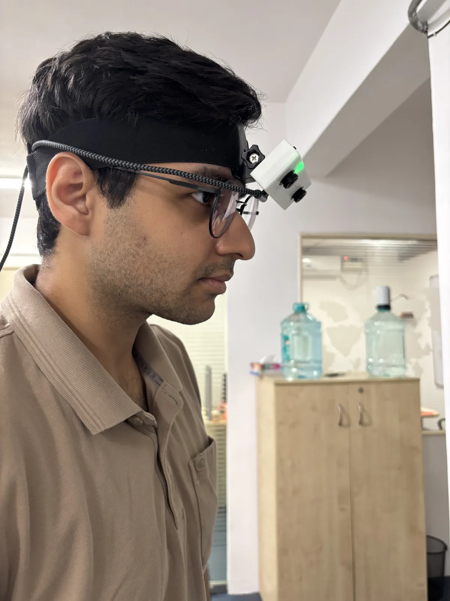
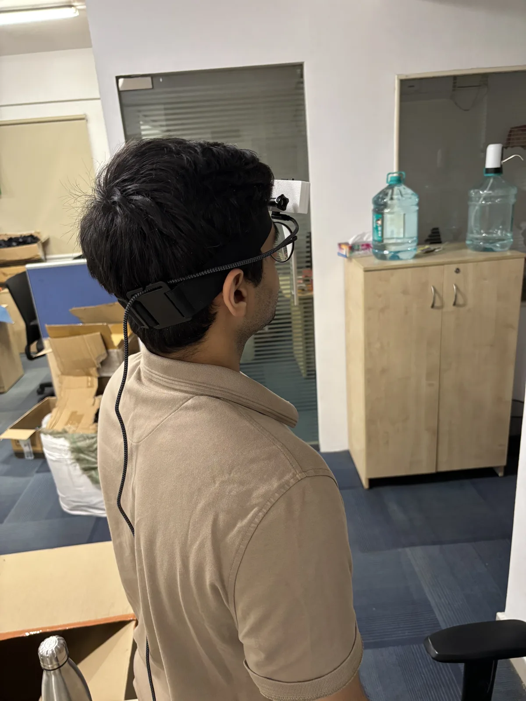

# Mounting

Trinet cameras use a standard action-camera style mount and ship with a head strap. Wrist cameras
in a [Wrist Kit](../products/wrist-kit.md) are worn on the wrists.

<figure markdown>
  { loading=lazy }
  <figcaption>Head strap: camera at the forehead, level and facing forward.</figcaption>
</figure>

<figure markdown>
  { loading=lazy }
  <figcaption>Route the USB cable along the strap to the back of the head.</figcaption>
</figure>

## Tips

- **Tighten the mount** so the camera can't wobble — motion data measures the camera, and any
  play in the mount shows up as vibration.
- **Keep it level and forward-facing** for egocentric recordings, roughly at eye height.
- **Route the cable along the strap** and secure it at the back so it doesn't tug the camera when
  you turn your head. Carry the power bank in a pocket or on a belt.
- **Don't cover the camera** with hair, hoods or fabric for long periods; it needs some air to stay
  cool (see [Heat](../power-and-care/thermal.md)).
- **Don't twist the lens** when mounting or cleaning — the focus is set at the factory.

!!! note "Calibration and mounts"
    Calibration describes the camera itself, so moving it between mounts doesn't change it. If you
    need the position of the camera relative to your body or a robot, measure that separately.
