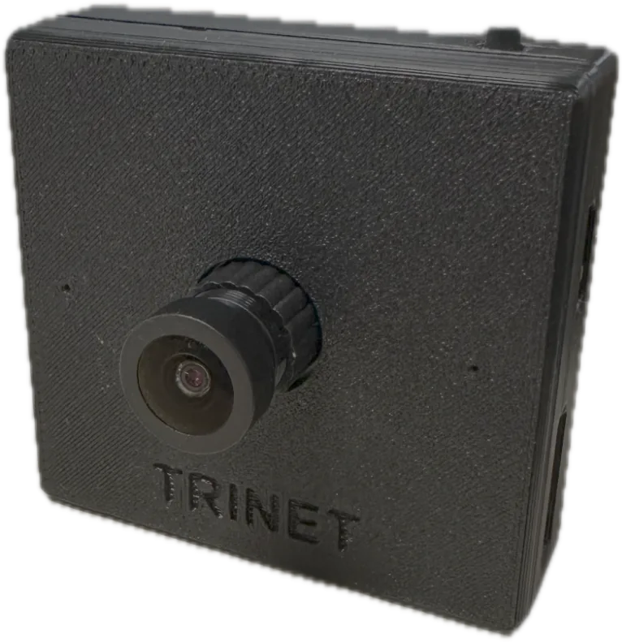
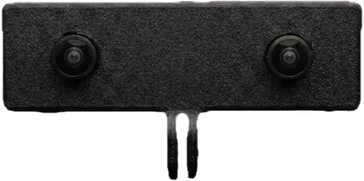

# Trinet Documentation

Everything you need to capture synchronized egocentric video and motion data with Trinet —
from your first recording to multi-camera kits, the Trinet app, firmware updates and building
your own software.

[Get started](get-started/index.md){ .md-button .md-button--primary }
[Get the Android app](app/index.md){ .md-button }
[Search the docs :material-magnify:](#){ .md-button onclick="document.querySelector('.md-search__input').focus(); return false;" }

## Choose your camera

-   { .product-shot loading=lazy }

    **Trinet Mono**

    ---

    A single ultra-wide camera with high-rate motion sensing and audio, on one shared clock.

    [:octicons-arrow-right-24: Trinet Mono](products/mono.md)

-   { .product-shot loading=lazy }

    **Trinet Stereo**

    ---

    Two cameras 70 mm apart for depth and 3D, with rolling-shutter sensors and per-unit factory
    calibration.

    [:octicons-arrow-right-24: Trinet Stereo](products/stereo.md)

-   { .product-shot loading=lazy }

    **Trinet Stereo GS**

    ---

    The stereo camera with global-shutter sensors — no motion skew for fast hand and head movement.

    [:octicons-arrow-right-24: Trinet Stereo GS](products/stereo-gs.md)

-   { .product-shot loading=lazy }

    **Trinet Wrist Kit**

    ---

    A head camera and two wrist cameras recording together on one wireless shared timeline.

    [:octicons-arrow-right-24: Trinet Wrist Kit](products/wrist-kit.md)

Not sure which one you have? See [Which camera do I have?](products/which-camera.md)

## Popular topics

-   :material-record-circle:{ .lg .middle } **Record your first take**

    ---

    Insert a card, power on, press the button. Five minutes from unboxing to your first recording.

    [:octicons-arrow-right-24: First recording](get-started/first-recording.md)

-   :material-led-on:{ .lg .middle } **What does the light mean?**

    ---

    Every colour and blink pattern of the status light, in every mode.

    [:octicons-arrow-right-24: LED indications](get-started/led-indications.md)

-   :material-battery-charging-high:{ .lg .middle } **Power and power banks**

    ---

    What to power the camera with, how long it runs, and power banks we've tested.

    [:octicons-arrow-right-24: Power & care](power-and-care/index.md)

-   :material-update:{ .lg .middle } **Update the firmware**

    ---

    Update from the Trinet app in about 30 seconds, and see what changed in every release.

    [:octicons-arrow-right-24: Firmware](firmware/index.md)

-   :material-language-python:{ .lg .middle } **Python toolkit**

    ---

    Inspect, repair, visualize and export recordings to MCAP / ROS 2 with Trinet-tools.

    [:octicons-arrow-right-24: Python toolkit](toolkit/index.md)

-   :material-android:{ .lg .middle } **Build with the SDK**

    ---

    Stream, record and play back Trinet video and motion data in your own Android or iOS app.

    [:octicons-arrow-right-24: Build apps](sdk/index.md)

## Why Trinet

- **One clock for everything.** Every video frame, motion sample and audio sample is timestamped
  on the same camera clock, so motion data lines up with video to well under a millisecond.
- **Cameras that agree with each other.** Cameras in a Wrist Kit share a wireless clock and stay
  within about a millisecond of each other.
- **Self-describing recordings.** Each recording carries the camera's identity and calibration,
  in open, documented file formats.
- **Works standalone or tethered.** Record to a memory card with one button, or stream over USB
  to an Android phone, iPhone or computer.

## Need help?

Search this site (press ++slash++), check [Troubleshooting](support/troubleshooting.md) and the
[FAQ](support/faq.md), or [contact us](support/index.md).
