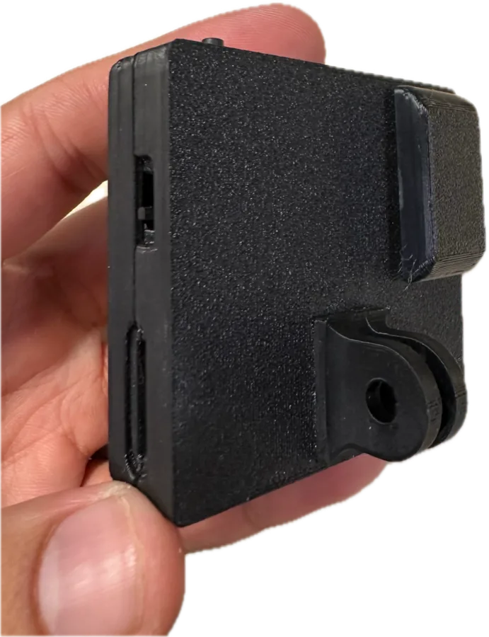
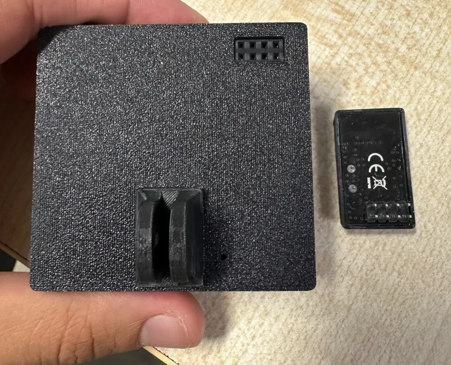

# Trinet Wrist Kit

The Trinet Wrist Kit combines a head camera with a camera on each wrist. The cameras share a clock
over a short-range radio link, start and stop together, and stamp every frame on one common
timeline — so the view from your head and the close-up views of both hands can be lined up
frame by frame.

<figure markdown>
  { .product-shot loading=lazy }
  <figcaption>Each kit camera needs a small radio-beacon adapter on the back (sold separately).</figcaption>
</figure>
<figure markdown>
  { .product-shot loading=lazy }
  <figcaption>The adapter is removable — keep it attached for kit recording.</figcaption>
</figure>

!!! info "Radio beacons are sold separately"
    Every camera in a Wrist Kit needs a radio-beacon adapter attached — it carries the wireless sync
    between cameras. Beacons are sold separately; [contact us](../support/index.md) to order. A camera
    used on its own doesn't need one.

## How it works

- **Factory-paired.** A kit arrives already paired: power the cameras on and they find each other.
- **One button starts the whole kit.** Press the button on any camera and every camera in the kit
  starts (or stops) recording together.
- **One timeline.** Cameras keep their clocks aligned to about 1 millisecond of each other while
  recording. Each camera records to its own memory card.
- **Robust to dropouts.** If the radio link drops mid-take, every camera keeps recording on its own
  and re-aligns when the link returns. Nothing is lost.
- **Kit-wide protection.** If any camera needs to cool down, the whole kit pauses and resumes
  together. If one camera's card fills up or is removed, the kit stops together so takes stay
  matched.
- **Mixed cameras.** Mono, Stereo and Stereo GS cameras can be members of the same kit.

## Setting up and pairing

Kits are paired at the factory. To pair cameras yourself, re-pair after replacing a camera, or
remove a camera from a kit, see [Set up a Wrist Kit](../get-started/wrist-kit-setup.md).

## Recordings from a kit

Each camera writes its own files to its own card. Takes recorded together share a kit prefix
(`grp…`) in their file names, so the matching files from each camera are easy to group. The
[Python toolkit](../toolkit/index.md) can play kit takes side by side and verify their sync, and
the [wireless UTC tool](../toolkit/wireless-utc.md) can place every take on UTC time.

## Watching a kit in the field

With firmware 0.5.9 or newer, every camera broadcasts its recording status over Bluetooth. The
[Trinet app's Wireless status](../app/wireless-status.md) screen shows each kit and camera —
recording or idle, card present, take number, model and firmware — and can alert you if a camera
stops unexpectedly. The app only listens; it never connects to or controls the cameras.

## Accuracy

| Measure | Typical |
|---|---|
| Motion data to video, within one camera | Sub-millisecond |
| Camera to camera within a kit | About 1 ms |

For the first one to two seconds after a take starts, cameras that are still locking on can be less
accurate; trim the first seconds if you need the tightest alignment. More in
[Timing and sync](../data/sync.md).
